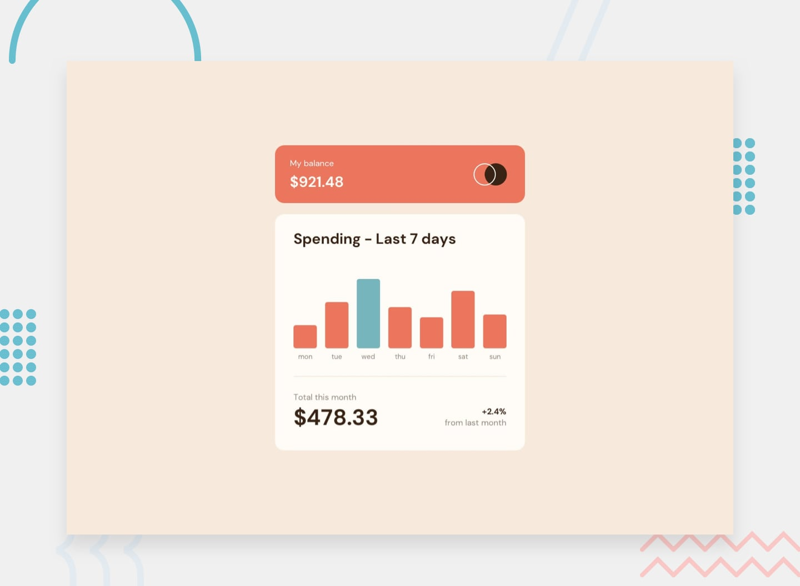

# Frontend Mentor - Expenses chart component solution

This is a solution to the [Expenses chart component challenge on Frontend Mentor](https://www.frontendmentor.io/challenges/expenses-chart-component-e7yJBUdjwt). Frontend Mentor challenges help you improve your coding skills by building realistic projects.

### Built with

- Semantic HTML5 markup
- CSS custom properties
- Flexbox
- CSS Grid
- JavaScript
- Async - Await

### Links

- Solution URL: <a href="https://github.com/Abgmz/fm-expenses-chart-component" target="_blank">https://github.com/Abgmz/fm-expenses-chart-component</a>
- Live Site URL: <a href="https://expenses-chart-comp.netlify.app/" target="_blank">https://expenses-chart-comp.netlify.app/</a>
